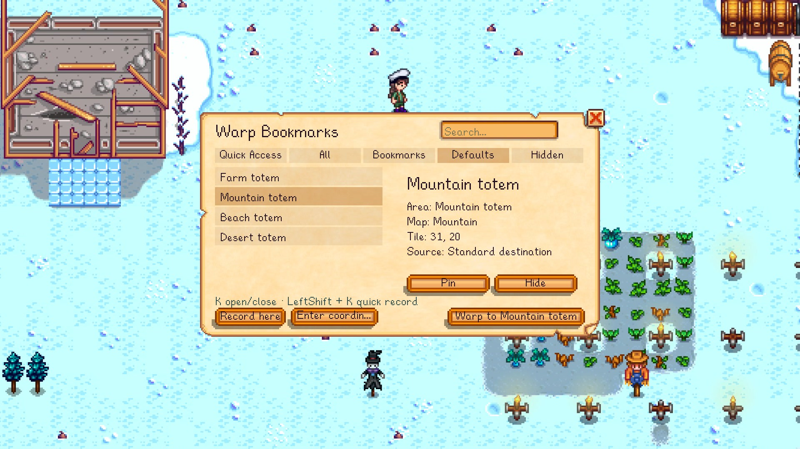
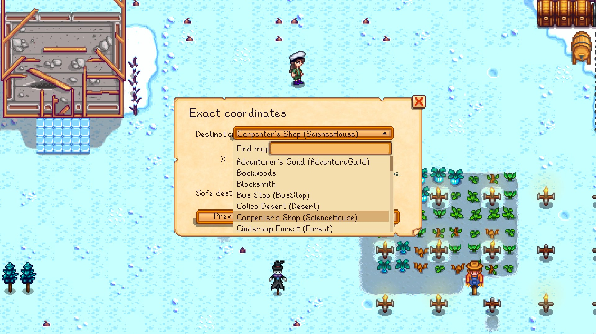

# Warp Bookmarks

[Download Warp Bookmarks 1.0.1 from GitHub Releases](https://github.com/M3tar/WarpBookmarks/releases/tag/v1.0.1) or [Nexus Mods](https://www.nexusmods.com/stardewvalley/mods/50310).

Version 1.0.1 improves the English layout, keeps saved CJK bookmark names readable after a language switch, and replaces unsupported font symbols with pixel-drawn UI indicators. See the [changelog](./CHANGELOG.md) and [Nexus update notes](./docs/NEXUS_UPDATE_1.0.1.md).

Available in Simplified Chinese and English, Warp Bookmarks turns the places you visit most into destinations you can reach in seconds. Whether it is your farm, Pelican Town, the mines, or a custom map, any location you have visited and are allowed to enter can be saved or selected by coordinates for fast, safe teleportation.

Open the searchable parchment travel book with `K`, or press `Shift + K` to record your current position instantly. You can also return home or travel back to the departure point of your previous successful teleport.

  

## Features

- Use the complete interface in Simplified Chinese or English, with saved Chinese bookmark names remaining readable after a language switch.
- Open the travel book with `K` and quickly save your current position with `Shift + K`.
- Save any visited, accessible location as a bookmark, or enter exact coordinates for fast, safe teleportation.
- Create, name, search, pin to Quick Access, rename, and delete personal bookmarks.
- Return to the outside of your own farmhouse or multiplayer cabin.
- Travel to the five standard vanilla Warp Totem destinations.
- Return to the departure point of your previous successful Warp Bookmarks teleport.
- Select a visited map, enter X/Y tile coordinates, preview the destination, teleport, or save it as a bookmark.
- Automatically search within three tiles when the requested tile is blocked.
- Keep custom bookmarks separate for each save and multiplayer player.
- Configure shortcuts through Generic Mod Config Menu when installed.

## Saved names remain readable across languages

User-created bookmark names are preserved exactly as entered. When an English or other Latin-language UI needs to display saved Chinese text, version 1.0.1 uses the game's localized font for those characters while keeping the surrounding interface in the selected language.

  

## Exact coordinates use visited maps

The map picker lists locations the current player has already visited. Choose a map, enter X/Y tile coordinates, preview the safe destination, and then warp or save it as a personal bookmark.

  

## Requirements

- Stardew Valley 1.6.15 or later in the 1.6 line;
- SMAPI 4.5.2 or later;
- Generic Mod Config Menu is optional.

## Installation

Download [`WarpBookmarks-1.0.1.zip` directly from GitHub](https://github.com/M3tar/WarpBookmarks/releases/download/v1.0.1/WarpBookmarks-1.0.1.zip), or get the mod from [Nexus Mods (Mod ID 50310)](https://www.nexusmods.com/stardewvalley/mods/50310).

1. Install [SMAPI](https://smapi.io/).
2. Download `WarpBookmarks-1.0.1.zip`, then extract the `WarpBookmarks` folder inside it into the game's `Mods` folder.
3. Confirm that the resulting path is `Mods/WarpBookmarks/WarpBookmarks.dll`.
4. Start the game through SMAPI and load a save.

If the DLL ends up at `Mods/WarpBookmarks/WarpBookmarks/WarpBookmarks.dll`, the archive was extracted with an extra folder level. Move the inner `WarpBookmarks` folder directly into `Mods`.

## First use

1. Press `K` after loading a save to open the travel book.
2. Select Home, Previous Location, a vanilla destination, or a personal bookmark on the left. Check its details, then use the main warp button in the lower-right corner.
3. To save your current position, select **Record current location** and enter a name. Press `Shift + K` instead to skip the naming window and create a bookmark with an automatic name.
4. Use the search field and categories to find destinations. Personal bookmarks can be pinned to Quick Access, renamed, or deleted.
5. For an exact destination, select **Enter coordinates…**, choose a map you have already visited, enter its X/Y tile coordinates, preview the result, then warp or save it as a bookmark.

To update, replace the existing `Mods/WarpBookmarks` folder with the new release. Personal bookmark data is stored in the player save data and is preserved when the mod folder is replaced.

To uninstall, remove `Mods/WarpBookmarks`. Saves remain playable; the unused bookmark data may remain in the save unless removed by a dedicated cleanup tool.

## Known limitation

The Left and Right arrow keys don't move the caret in the bookmark rename field. Backspace and retyping still work, and this doesn't affect saving or teleporting.

## Compatibility scope

The mod is designed around stable game location names and should work with many conventional custom maps. Warp Bookmarks has been tested on Windows with Stardew Valley 1.6.15 and SMAPI 4.5.2 in single-player and online multiplayer. Universal compatibility with every expansion mod is not guaranteed.
