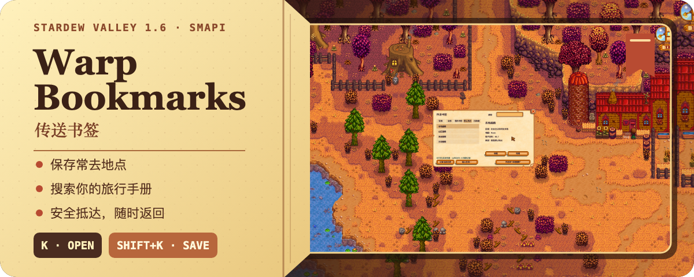
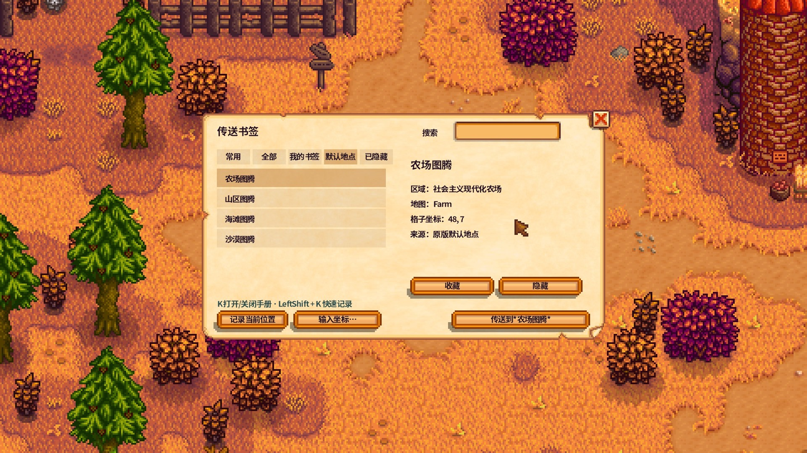
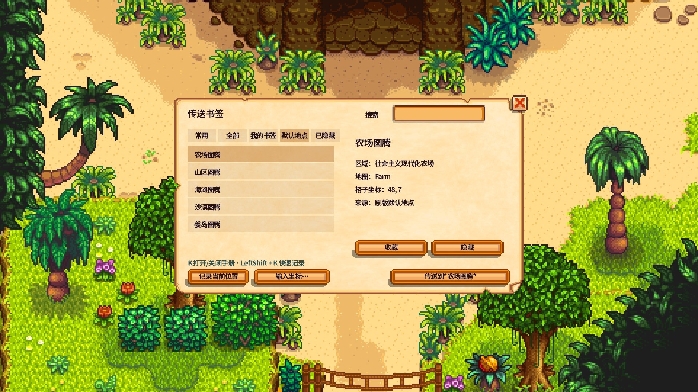
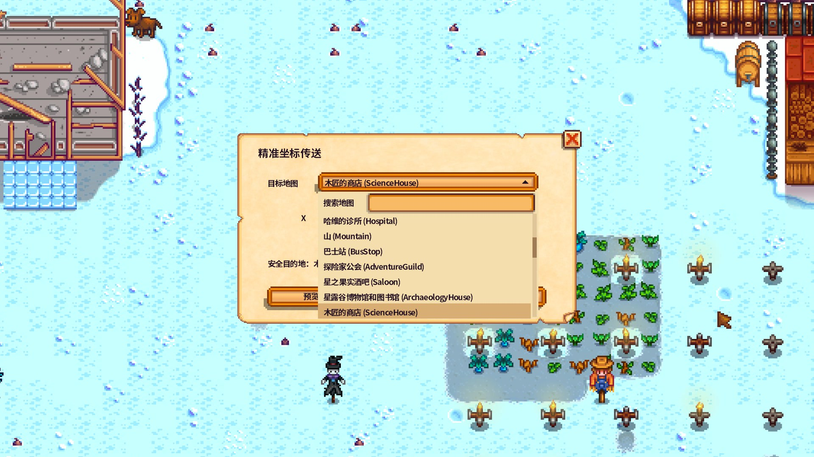
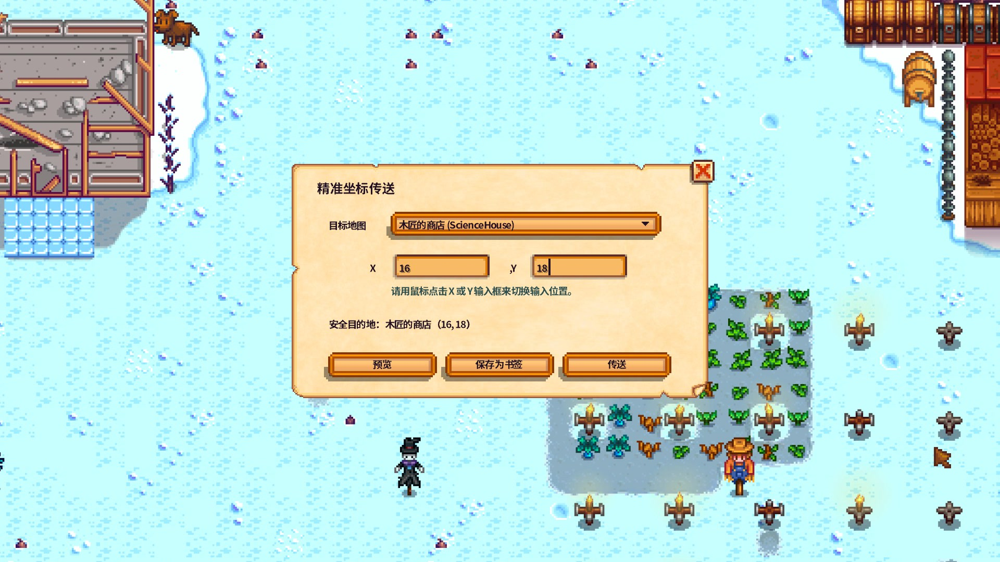
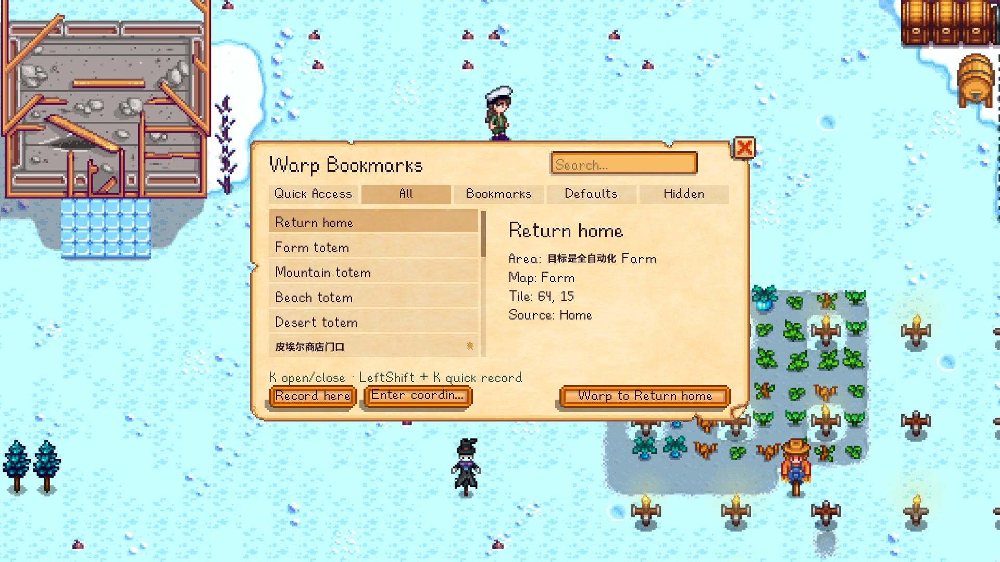

  

  <a href="https://github.com/M3tar/WarpBookmarks/releases/tag/v1.0.1"><strong>GitHub Release · 下载 WarpBookmarks-1.0.1.zip</strong></a> 
   
  <a href="https://www.nexusmods.com/stardewvalley/mods/50310"><strong>Nexus Mods · Mod ID 50310</strong></a> 
  可从 GitHub Releases 或 Nexus Mods 获取正式版本

  <strong>简体中文 / English · 快速传送 · 单人 / 在线联机</strong> 
  <a href="./README.en.md">English</a> ·
  <a href="#功能">功能</a> ·
  <a href="#安装">安装</a> ·
  <a href="#兼容性">兼容性</a> ·
  <a href="./CHANGELOG.md">更新记录</a>

每天在农场、温室、矿洞和海边来回跑，走着走着，一天就过去了。尤其是在线联机时游戏不会暂停：送完礼、钓完鱼或下矿太晚，还要一路冲回家，稍不注意就会在路上晕倒。

**Warp Bookmarks（传送书签）** 支持简体中文与英文界面，让常去地点真正变成随时可达的书签。无论是农场、城镇、矿洞还是自定义地图，只要地点已经到访且允许进入，就能记录位置或输入坐标，快速安全传送。

按 `K` 打开可搜索的羊皮纸旅行手册，按 `Shift + K` 随手记录当前位置；以后可以搜索书签并直接传送，也可以快速返回住宅或“上一个位置”。

它不占背包格，不需要制作任何道具，也没有材料消耗、充能、冷却或升级系统。安装后即可使用，支持单人与在线联机。

## 一本手册，收好所有常去地点

  

这是传送手册的“书签”页面：左侧可以搜索并选择个人地点，右侧显示区域、地图、格子坐标和书签来源；底部提供记录当前位置、输入坐标、加入常用、重命名、删除和传送操作。两个默认快捷键都可以通过 Generic Mod Config Menu 或 `config.json` 修改。

<strong>查看更多实机画面</strong>

 

### 未解锁区域不会提前出现

默认地点遵循当前存档的正常游戏进度。下面两张截图使用同一套传送手册：玩家尚未解锁姜岛时，列表只显示农场、山区、海滩和沙漠；正常解锁并到达姜岛后，姜岛才会加入可传送地点。

**姜岛解锁前 — 列表中没有姜岛**

  

截图左侧的“常用”列表只包含农场、山区、海滩和沙漠。此时存档尚未正常开放姜岛，因此手册不会提前显示姜岛入口。

**姜岛解锁后 — 列表自动新增姜岛**

  

玩家正常解锁并实际到达姜岛后，同一位置的列表会自动增加“姜岛”。不需要修改配置，也不需要重新创建书签。

这项限制也适用于精准坐标传送：不能利用地图名称或坐标跳过尚未正常开放的区域。

### 精准坐标只列出已到访地图

目标地图下拉框来自当前玩家已经到访的地点。选择地图并填写 X/Y 格子坐标后，必须先预览解析结果，再决定直接传送或保存为个人书签。

  

截图中的地图下拉框只列出当前玩家已经到访的区域。右侧会先显示地图名称和解析后的目标格子，确认无误后再选择“传送”或“保存为书签”；如果目标格被水、墙壁或其他物体挡住，Mod 会在附近三格内寻找安全落点。

**确认坐标后的预览与操作**

  

填写坐标并预览后，窗口会明确显示最终安全目的地；可以直接传送，也可以先保存为个人书签，方便以后从手册中快速返回。

### 切换语言后，旧书签名仍可阅读

`1.0.1` 会在英文等拉丁语言界面中按需使用游戏自带的中文字体显示已有中文书签名。书签名称和常用状态保持原样，地图显示名则跟随当前游戏语言刷新。

  

## 功能

- **中英双语**：完整支持简体中文和英文界面；切换语言后，已有的中文书签名仍然清晰可读。
- **个人书签**：创建、命名、搜索、加入常用、重命名和删除自己的地点。
- **快速传送**：将已经到访且允许进入的地点保存为书签，也可以输入精确坐标并安全传送。
- **快速返回**：回到自己的住宅门外，或在两个地点之间使用“上一个位置”往返。
- **原版目的地**：使用农场、山区、海滩、沙漠和姜岛五个标准传送图腾地点。
- **精准坐标**：选择已经到访的地图，输入 X/Y 格子坐标，预览后传送或另存为书签。
- **安全落点**：目标格被阻挡时，在附近三格内寻找可用位置；失败不会覆盖上一个位置。
- **联机隔离**：书签按存档、玩家和屏幕分别保存，在线联机玩家互不共享数据。
- **原版手感**：16:9 羊皮纸菜单、即时搜索、分类筛选和可选 GMCM 改键。

  

## 安装

### 下载

- [从 GitHub Release 直接下载 `WarpBookmarks-1.0.1.zip`](https://github.com/M3tar/WarpBookmarks/releases/download/v1.0.1/WarpBookmarks-1.0.1.zip)
- [前往 Nexus Mods 下载（Mod ID 50310）](https://www.nexusmods.com/stardewvalley/mods/50310)

### 要求

- Stardew Valley `1.6.15` 或 1.6 系列兼容后续版本
- SMAPI `4.5.2` 或更高版本
- Generic Mod Config Menu（可选，仅用于游戏内修改快捷键）

### 开始使用

1. 安装 [SMAPI](https://smapi.io/)。
2. 下载 `WarpBookmarks-1.0.1.zip`，将压缩包里的 `WarpBookmarks` 文件夹解压到游戏的 `Mods` 目录。
3. 确认文件位于 `Mods/WarpBookmarks/WarpBookmarks.dll`。
4. 通过 SMAPI 启动游戏，载入存档后按 `K`。

> [!TIP]
> 如果最终路径变成 `Mods/WarpBookmarks/WarpBookmarks/WarpBookmarks.dll`，说明多套了一层文件夹；请将内层 `WarpBookmarks` 移到 `Mods` 下。

### 第一次使用

1. 载入存档后按 `K` 打开传送手册。
2. 在左侧选择住宅、上一个位置、原版目的地或个人书签；确认右侧地点信息后，点击右下角的传送按钮。
3. 想保存当前位置时，点击“记录当前位置”并输入名称；也可以按 `Shift + K` 跳过命名窗口，用自动名称快速记录。
4. 通过顶部搜索与分类查找地点；选中个人书签后，可以加入“常用”、重命名或删除。
5. 需要精准传送时，点击“输入坐标…”，选择已经到访的地图并输入 X/Y 格子坐标；先查看预览，再传送或保存为书签。

| 操作 | 默认快捷键 |
| --- | :---: |
| 打开 / 关闭传送手册 | `K` |
| 快速记录当前位置 | `Shift + K` |

更新时直接替换 `Mods/WarpBookmarks` 文件夹。个人书签保存在玩家存档中，不会因替换 Mod 文件夹而丢失。

卸载时删除 `Mods/WarpBookmarks` 即可。存档仍可正常使用；未使用的书签 `modData` 可能继续保留在存档中。

## 兼容性

Warp Bookmarks 已在 Windows 11、Stardew Valley 1.6.15、SMAPI 4.5.2 环境完成单人与在线联机验证。Mod 使用稳定的游戏地点标识，预期可与许多常规自定义地图共同使用，但不承诺兼容所有大型扩展或特殊地图。

> [!NOTE]
> 重命名书签时，左右方向键目前不能移动插入光标；退格后重新输入仍可正常保存，不影响搜索或传送。详见[已知问题](./docs/KNOWN_ISSUES.md)。

## 项目状态

`1.0.1` 最终安装包与中英文实机截图已经完成仓库审核，等待发布前的最终差异确认。发布后可从 [GitHub Releases](https://github.com/M3tar/WarpBookmarks/releases/tag/v1.0.1) 或 [Nexus Mods（Mod ID 50310）](https://www.nexusmods.com/stardewvalley/mods/50310) 获取。Windows 验证步骤见 [1.0.1 发布测试](./docs/WINDOWS_RELEASE_TEST_1.0.1.md)。

开发与设计资料：

- [产品规格](./docs/PRODUCT_SPEC.md) · [UI 与交互](./docs/UX_UI_SPEC.md) · [技术设计](./docs/TECHNICAL_PLAN.md)
- [测试计划](./docs/TEST_PLAN.md) · [Windows 1.0.1 发布测试](./docs/WINDOWS_RELEASE_TEST_1.0.1.md)
- [产品决策](./docs/DECISIONS.md) · [当前状态](./docs/STATUS.md) · [1.0.1 Nexus 更新文案](./docs/NEXUS_UPDATE_1.0.1.md) · [1.0.1 发布清单](./docs/NEXUS_RELEASE_CHECKLIST_1.0.1.md)

项目标识：`Mercury.WarpBookmarks` · 程序集：`WarpBookmarks.dll` · 目标框架：`.NET 6`
